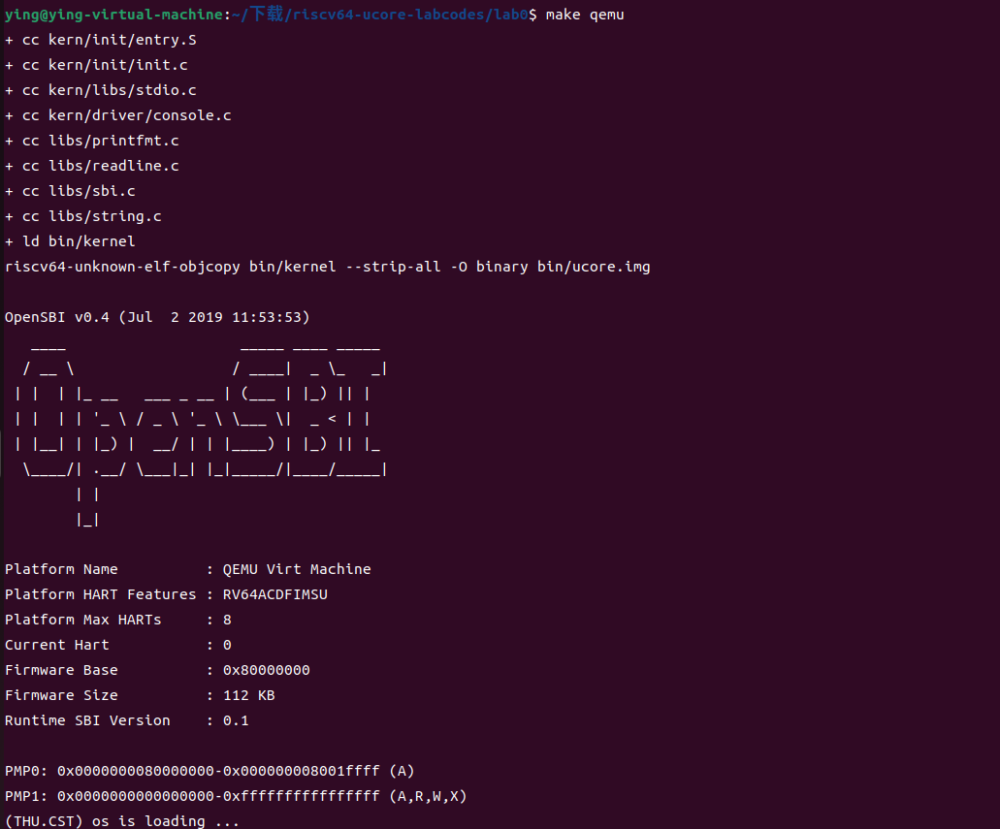
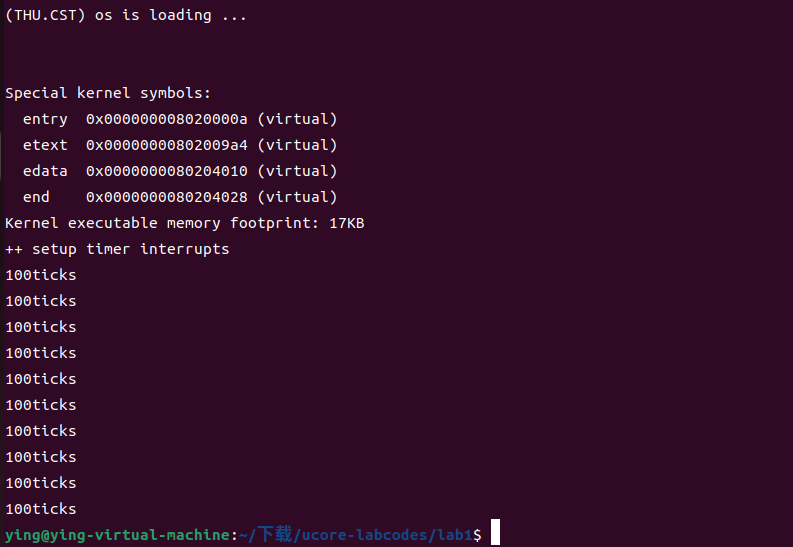
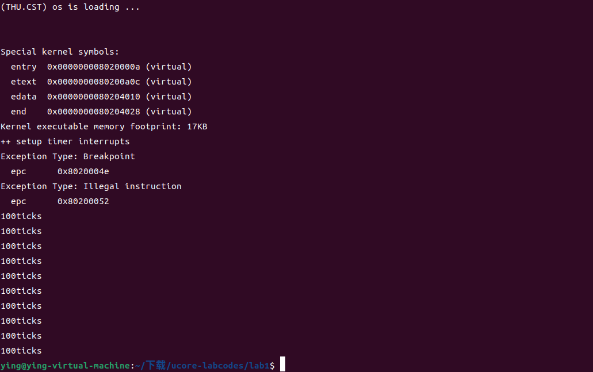

# LAB0.5 最小可执行内核

## 实验目的
- 学习使用 链接脚本 描述内存布局
- 学习进行 交叉编译 生成可执行文件，进而生成内核镜像
- 学习使用 OpenSBI 作为 bootloader 加载内核镜像，并使用 Qemu 进行模拟
- 学习使用 OpenSBI 提供的服务，在屏幕上格式化打印字符串用于以后调试

## 实验内容
ucore内核主要在 Qemu 模拟器上运行，它可以模拟一台 64 位 RISC-V 计算机。为了让内核能够正确对接到 Qemu 模拟器上，需要了解 Qemu 模拟器的启动流程，还需要一些程序内存布局和编译流程（特别是链接）相关知识,以及通过OpenSBI固件来通过服务。

### 练习1: 使用GDB验证启动流程
为了熟悉使用qemu和gdb进行调试工作,使用gdb调试QEMU模拟的RISC-V计算机加电开始运行到执行应用程序的第一条指令（即跳转到0x80200000）这个阶段的执行过程，说明RISC-V硬件加电后的几条指令在哪里？完成了哪些功能？

首先运行 `make debug` ，使Qemu模拟的riscv架构CPU上电但暂时不执行指令；再在新的终端窗口中运行 `make gdb` 接入调试工具。其中，Makefile调用的指令如下：

```
debug: $(UCOREIMG) $(SWAPIMG) $(SFSIMG)
	$(V)$(QEMU) \
		-machine virt \
		-nographic \
		-bios default \
		-device loader,file=$(UCOREIMG),addr=0x80200000\
		-s -S
gdb:
	riscv64-unknown-elf-gdb \
    -ex 'file bin/kernel' \
    -ex 'set arch riscv:rv64' \
    -ex 'target remote localhost:1234'
```
首先通过 `x/10i $pc` 查看即将执行的十条指令。这就是RISC-V硬件加电后的几条指令，位于物理地址0x1000处。用于在 RISC-V 架构中进行程序控制和加载还有Bootloader的启动。经`si`与`info r t0`等gdb指令检查， 在执行`jr t0`命令前，t0寄存器已通过计算指向地址`0x80000000`。
```
=> 0x1000:	auipc	t0,0x0
   0x1004:	addi	a1,t0,32
   0x1008:	csrr	a0,mhartid
   0x100c:	ld	t0,24(t0)
   0x1010:	jr	t0
   0x1014:	unimp
   0x1016:	unimp
   0x1018:	unimp
   0x101a:	0x8000
   0x101c:	unimp
```
随后pc跳转到`0x8000000`处，开始运行作为 bootloader 的 `OpenSBI.bin`，接下来的汇编指令进行了较为复杂的准备工作，并把内核镜像`os.bin` 被加载到以物理地址 `0x80200000` 开头的区域上。此处展示`0x8000000`开头区域的部分指令：
```
=> 0x80000000:	csrr	a6,mhartid
   0x80000004:	bgtz	a6,0x80000108
   0x80000008:	auipc	t0,0x0
   0x8000000c:	addi	t0,t0,1032
   0x80000010:	auipc	t1,0x0
   0x80000014:	addi	t1,t1,-16
   0x80000018:	sd	t1,0(t0)
   0x8000001c:	auipc	t0,0x0
   0x80000020:	addi	t0,t0,1020
   0x80000024:	ld	t0,0(t0)
```
使用指令`break *0x80200000`在`0x80200000`处设置断点，随后使用`continue`让程序执行至断点处。`0x80200000`开头的区域上的指令如下：
```
=> 0x80200000 <kern_entry>:	auipc	sp,0x3
   0x80200004 <kern_entry+4>:	mv	sp,sp
   0x80200008 <kern_entry+8>:	j	0x8020000a <kern_init>
   0x8020000a <kern_init>:	auipc	a0,0x3
   0x8020000e <kern_init+4>:	addi	a0,a0,-2
   0x80200012 <kern_init+8>:	auipc	a2,0x3
   0x80200016 <kern_init+12>:	addi	a2,a2,-10
   0x8020001a <kern_init+16>:	addi	sp,sp,-16
   0x8020001c <kern_init+18>:	li	a1,0
   0x8020001e <kern_init+20>:	sub	a2,a2,a0
```
通过`<kern_entry>`与`<kern_init>`等函数可以看出，对应着`kern/init/`文件夹下的`entry.S`与`init.c`中的kern_entry、kern_init函数（操作系统的入口点与初始化函数）。

Qemu保证内核的第一条指令位于物理地址 0x80200000 处。为此，我们需要将内核镜像预先加载到 Qemu 物理内存以地址 0x80200000 开头的区域上。一旦 CPU 开始执行内核的第一条指令，证明计算机的控制权已经被移交给我们的内核。



## 知识点
- bootloader：负责boot(开机)，还负责load(加载OS到内存里)。

    CPU是无法直接启动操作系统内核，需要借助“驱动程序”告知CPU从哪里、如何启动操作系统。而这些“驱动程序”（即bootloader），需要存储在一个不需要“其他驱动程序”CPU就能直接读取的地方。在CPU启动时，会首先运行这些代码bootloader，用这些代码实现对硬盘、内存和其他复杂设备的读取。在QEMU模拟的riscv计算机里，我们使用QEMU自带的bootloader: OpenSBI固件以加载内核。
- 固件(firmware)是一种特定的计算机软件，它为设备的特定硬件提供低级控制，也可以进一步加载其他软件，处于硬件与软件中间的层级。OpenSBI运行在M态（M-mode），因为固件需要直接访问硬件。
- bin与elf

    在elf文件中想要记录一个全部初始化为0的数组，只需记住数组的起点和终点。但bin文件中，bin文件会完全按实际位数记录数组。所以同样的程序生成的bin文件会比elf文件大很多。


# LAB1 中断处理机制
## 实验目的
- 学习riscv 的中断相关知识
- 了解中断前后如何进行上下文环境的保存与恢复
- 处理最简单的断点中断和时钟中断

## 实验内容
### 练习1：理解内核启动中的程序入口操作
阅读 kern/init/entry.S内容代码，结合操作系统内核启动流程，说明指令 la sp, bootstacktop 完成了什么操作，目的是什么？ tail kern_init 完成了什么操作，目的是什么？

- la sp, bootstacktop

    将 sp 寄存器设置为 bootstacktop 的地址，即堆栈的顶部。这样做初始化了内核的堆栈指针，使得内核可以在启动过程中正确地使用堆栈。
- tail kern init

    无条件跳转到 kern_init 函数，开始内核的初始化过程。由于 tail 不保存返回地址，这意味着 kern_init 是内核启动后的主要控制流，不会再返回到 kern_entry。


### 练习2：完善中断处理
请编程完善trap.c中的中断处理函数trap，在对时钟中断进行处理的部分填写`kern/trap/trap.c`函数中处理时钟中断的部分，使操作系统每遇到100次时钟中断后，调用`print_ticks`子程序，向屏幕上打印一行文字”100 ticks”，在打印完10行后调用`sbi.h`中的shut_down()函数关机。

简要说明实现过程和定时器中断中断处理的流程

修改后加入的代码如下：
```
case IRQ_S_TIMER:
    clock_set_next_event();
    ticks += 1;
    if(ticks == TICK_NUM){
        print_ticks();
        num+=1;
        ticks = 0;
    }
    if(num==10){
        sbi_shutdown();  //guanjihanshu ?
    }
    break;
```

运行结果如下：


### 扩展练习 Challenge1：描述与理解中断流程
回答：描述ucore中处理中断异常的流程（从异常的产生开始），其中mov a0，sp的目的是什么？SAVE_ALL中寄存器保存在栈中的位置是什么确定的？对于任何中断，__alltraps 中都需要保存所有寄存器吗？请说明理由。

#### 中断/异常处理流程

1. **异常产生**：
   
   当处理器遇到一个异常情况（如除以零、非法指令、外部中断等）时，它会暂停当前执行的用户程序或内核代码，并自动将一些关键状态信息（例如PC、异常原因等）保存到特定的CSRs（控制和状态寄存器）中。然后，处理器跳转到中断处理程序的地址（存于`stvec`中）。

2. **__alltraps**：
   - `stvec`被设置为指向`__alltraps`函数。在`__alltraps`中，首先通过`SAVE_ALL`宏保存保存所有寄存器到栈顶（用以确保在处理完异常之后能够正确地恢复执行环境）。
        - 此处`__alltraps`确实需要保存所有通用寄存器（除了x0），因为内核无法预先知道哪些寄存器是正在使用的。为了保证数据一致性，只能不加区分全部保存。
        - 寄存器保存位置：每个寄存器被存储在相对于新的栈顶指针sp的一个特定偏移位置。具体的偏移量是通过`REGBYTES`乘以一个索引来计算的。其中，由于不允许直接从CSR写入内存，所以先将CSR寄存器的值读取到通用寄存器中、再存储到栈中。
   - 此后，通过`move a0, sp`指令将栈指针`sp`的值复制到`a0`寄存器中。因为之后将要调用`trap`函数，`a0`寄存器需要用以传递参数。之后`trap`函数可以通过该参数访问到保存的上下文，并且可以根据需要读取或修改这些寄存器的值。

3. **trap函数**：
    
    `jal trap`指令跳转到C语言编写的`trap`函数。`trap`函数根据陷阱帧中的信息来识别中断或异常的类型，并调用相应的处理程序来处理这些事件。

4. **返回并恢复上下文**：

   `trap`函数返回后，控制权回到`__alltraps`中的`__trapret`标签处。使用`RESTORE_ALL`宏从栈中恢复之前保存的所有寄存器。最后，通过`sret`指令使处理器从异常处理模式返回到之前的执行模式，并且继续执行被中断前的下一条指令。


### 扩增练习 Challenge2：理解上下文切换机制
回答：在trapentry.S中汇编代码 csrw sscratch, sp；csrrw s0, sscratch, x0实现了什么操作，目的是什么？save all里面保存了stval scause这些csr，而在restore all里面却不还原它们？那这样store的意义何在呢？

- **`csrw sscratch, sp`**：
   将当前的栈顶指针 `sp` 的值写入 `sscratch` CSR。目的是保存当前的栈顶指针，以便在发生嵌套异常时能够恢复到正确的栈位置。
- **`csrrw s0, sscratch, x0`**：
   从 `sscratch` CSR 读取值并将其存储到通用寄存器 `s0` 中，同时将 `x0` 寄存器（值为 0）的值写入 `sscratch` CSR。目的是将之前保存的栈顶指针 `sp` 的值读取到 `s0` 寄存器中，并将 `sscratch` CSR 设置为 0。设置 `sscratch` 为 0 是为了在发生嵌套异常时告诉异常向量当前是在内核模式下执行。

`sscratch`寄存器在处理用户态程序的中断时才起作用。现在我们编写的ucore处理的中断都还是在内核模式下发生的，并且还原时中断问题已被解决、不再需要记录。

`stval`寄存器记录的是一些中断处理所需要的辅助信息，比如指令获取(instruction fetch)、访存、缺页异常，它会把发生问题的目标地址或者出错的指令记录下来，这样我们在中断处理程序中就知道处理目标了。但在还原时已经完成了对程序中断问题的解决，不需要再保存`stval`。


### 扩展练习Challenge3：完善异常中断
完善后修改的部分如下：
```
case CAUSE_ILLEGAL_INSTRUCTION:
    cprintf("Exception Type: Illegal instruction\n"); //(1)
    cprintf("  epc      0x%08x\n", tf->epc);
    tf->epc += 4;
    break;
case CAUSE_BREAKPOINT:
    cprintf("Exception Type: Breakpoint\n"); //(1)
    cprintf("  epc      0x%08x\n", tf->epc);
    tf->epc += 4;
    break;
```
在`init.c`中构建异常：
```
__asm__ volatile("ebreak");
__asm__ volatile("mv s1,zero");
__asm__ volatile("div s0,s0,s1");
```

运行结果如下：
