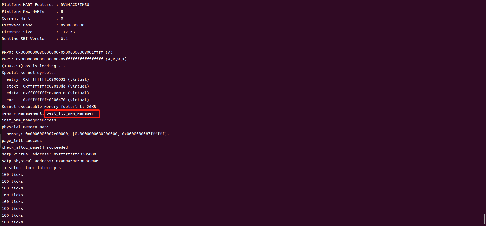
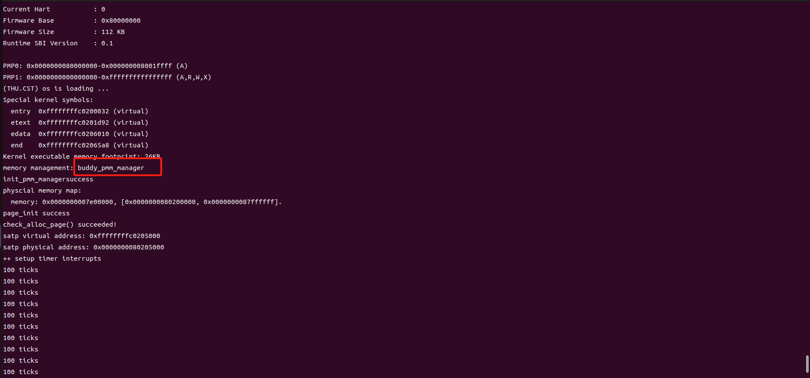

# LAB2 物理内存和页表

## 实验目的
- 理解页表的建立和使用方法
- 理解物理内存的管理方法
- 理解页面分配算法

## 实验内容
实验二主要涉及操作系统的物理内存管理。操作系统为了使用内存，还需高效地管理内存资源。本次的实验主要是在实验一的基础上完成物理内存管理，并建立一个最简单的页表映射。在本次实验中，将介绍如何发现系统中的物理内存，学习如何建立对物理内存的初步管理（即了解连续物理内存管理），最后掌握页表相关的操作（即如何建立页表来实现虚拟内存到物理内存之间的映射），帮助我们对段页式内存管理机制有一个比较全面的了解。

### 练习1：理解first-fit 连续物理内存分配算法
first-fit 连续物理内存分配算法作为物理内存分配一个很基础的方法，需要同学们理解它的实现过程。请大家仔细阅读实验手册的教程并结合kern/mm/default_pmm.c中的相关代码，认真分析default_init，default_init_memmap，default_alloc_pages， default_free_pages等相关函数，并描述程序在进行物理内存分配的过程以及各个函数的作用。 请在实验报告中简要说明你的设计实现过程。请回答如下问题：
你的first fit算法是否有进一步的改进空间？

在pmm.h中，通过结构体与函数指针的方式设计了pmm_manager的机制，可通过pmm.c中的init_pmm_manager函数确定调用哪种策略（best_fit_pmm_manager/default_pmm_manager）并初始化。
```
struct pmm_manager {
    const char *name;  
    void (*init)(void); 
    void (*init_memmap)(struct Page *base,size_t n); 
    struct Page *(*alloc_pages)(size_t n);  
    void (*free_pages)(struct Page *base, size_t n); 
    size_t (*nr_free_pages)(void);  
    void (*check)(void); 
};
```
first-fit连续物理内存分配算法的核心思想就是分配时从链表中找到第一个大小足够的空闲页块、释放时将页面添加会链表并在必要时合并相邻空闲页块。

1. **default_init**

default_init函数在init_pmm_manager函数中就会调用，对物理内存管理器进行了初始化——把用来保存内存空间空闲页的链表free_list初始化成空链表，同时把记录空闲物理页个数的nr_free设置为0（事实上，这两个变量是free_area_t结构体中的元素，只是被宏定义后可直接使用）。

2. **default_init_memmap**

该函数初始化从 base 开始的连续n个页。首先遍历这些页，设置它们的 flags 和 property 为 0，并将引用计数 ref 设置为 0。之后将第一个页 base 的 property 设置为 n，表示这个连续空闲页块的大小；再更新 nr_free 以反映新的空闲页数量。如果 free_list 为空，则可以直接将base添加到 free_list；否则，在适当的位置插入 base（保持 free_list 按地址顺序排列）。

3. **default_alloc_pages**

该函数对n个连续页的请求进行分配。如果请求的页数大于当前空闲页数，则返回空值。
反之，则遍历 free_list，直到找到第一个足够大的空闲块，再从 free_list 中删除该块。如果使用后剩余的页数大于0，则创建一个新的空闲块（块大小为剩余页数），并将其插入到 free_list 中，更新 nr_free 并清除 page 的 property 标志位。最后返回分配的页的起始地址。

4. **default_free_pages**

该函数释放从base开始的n个连续页。首先遍历这些页，设置它们的 flags 为 0，并将引用计数 ref 设置为 0；再将 base 的property设置为 n，并设置property标志位使其可被分配，更新 nr_free 以反映新的空闲页数量，在适当的位置将 base 插入到 free_list 中。最后尝试合并相邻的空闲块。

**first-fit算法确实存在一定的改进空间：**
1. 延迟合并：当释放页面时，不立即执行合并，而是周期性地执行合并操作，这样可以减少高负载下的性能开销。
2. 内存碎片：可能会导致内存碎片问题，从而降低内存使用效率。
3. 搜索优化：首次适配算法从空闲列表的头部开始搜索，找到第一个足够大的空闲块进行分配，遍历可能会导致性能瓶颈。可以使用高级数据结构来加速搜索过程。

### 练习2：实现 Best-Fit 连续物理内存分配算法
在完成练习一后，参考kern/mm/default_pmm.c对First Fit算法的实现，编程实现Best Fit页面分配算法，算法的时空复杂度不做要求，能通过测试即可。 请在实验报告中简要说明你的设计实现过程，阐述代码是如何对物理内存进行分配和释放，并回答如下问题：
你的 Best-Fit 算法是否有进一步的改进空间？



best_fit_init，best_fit_init_memmap， best_fit_free_pages等函数均与first_fit策略中的实现过程类似，没有什么改动，故在此不作阐释。主要说明best_fit_alloc_pages函数：通过遍历空闲页块链表寻找最合适的页块——其中，如果有与目标大小相同的页块就不用再找了可直接中断遍历；如果没有，当结束循环时，page中存的就是最合适的页块的地址。
```
int tmp; // 记录当前最合适的页数
while ((le = list_next(le)) != &free_list) {
    struct Page *p = le2page(le, page_link);
    if (p->property == n) { // 如果相等就已经很合适了
        page = p;
        break;
    }
    else if (p->property < tmp && p->property >=n) {
        page = p;
        tmp = p->property;
    }
}
//此时的page就是最合适的了
```
与First Fit类似，延迟合并的方向仍可进一步改进。此外，因为分配时找到的是大小更合适的页块，因此可在一定程度上减轻内存碎片的问题。但也因需完全遍历整个空闲链表，较First Fit需要更大的时间开销，更需搜索优化。

### 扩展练习Challenge：buddy system（伙伴系统）分配算法
Buddy System算法把系统中的可用存储空间划分为存储块(Block)来进行管理, 每个存储块的大小必须是2的n次幂(Pow(2, n)), 即1, 2, 4, 8, 16, 32, 64, 128...
参考伙伴分配器的一个极简实现， 在ucore中实现buddy system分配算法，要求有比较充分的测试用例说明实现的正确性，需要有设计文档。

- **Buddy System实现原理**
    - 初始化：分配节点数量（size^2）的longest数组，并且把对应的longest[i]赋值为相应空闲单位。返回初始化完成的buddy2结构体。
    - 分配内存：寻找大小合适的内存块（>=所需大小并且最接近2的幂）。
        1. 对半分离出高于所需大小的空闲内存块
        2. 如果分到最低限度，分配这个大小。
        3. 回溯到步骤1（寻找合适大小的块）
        4. 重复该步骤直到一个合适的块
    - 释放内存
        1. 寻找相邻的块，看其是否释放了。
        2. 如果相邻块也释放了，合并这两个块，重复上述步骤直到遇上未释放的相邻块，或者达到最高上限（即所有内存都释放了）。

- **具体实现**
    ```
    //设置全局变量
    list_entry_t free_list[20]; //存放不同阶块的链表（此处结合虚拟机实际情况设置为20）
    unsigned int nr_free; //记录当前空闲块的数量
    struct Page* addr; //记录所有页的首页的地址，以便合并
    ```
    - buddy_init
    ```
    static void
    buddy_init(void) {
        for(int i = 0; i<20; i++){
            list_init(&free_list[i]); //初始化所有阶数链表
        }
        nr_free = 0;
    }
    ```
    - buddy_init_memmap
    ```
    static void
    buddy_init_memmap(struct Page *base, size_t n) {
        assert(n > 0);
        int es = 0;
        if ((n&(n-1))!=0){
            es = n - fixsize(n)/2;
            n = fixsize(n)/2; //最大的小于n的2次幂
        }//n是最大块数，es是剩的
        int index = mi(n); //计算阶数
        
        struct Page *p = base;
        for (; p != base + n + es; p ++) {
            assert(PageReserved(p));
            p->flags = p->property = 0;
            set_page_ref(p, 0);
        }

        base->property = n;
        SetPageProperty(base);
        (base+n)->property = es;
        SetPageProperty(base+n);
        nr_free += n+es;
        addr = base;
        list_add(&free_list[index-1], &(base->page_link));
        list_add(&free_list[index], &((base+n)->page_link));
        //剩的块会加到链表末尾，但是不会用（至少现在没写怎么用的代码）
        //直接当是初始状态处理了
        return;
    }
    ```
    - buddy_alloc_pages
    ```
    static struct Page *
    buddy_alloc_pages(size_t n) {
        assert(n > 0);
        if (n > nr_free) { return NULL; }//空间不足
        
        int nn = n;
        if((n&(n-1))!=0){ nn = fixsize(n); } //要求分配的不是2次幂
        int ind = mi(nn)-1; //对应的阶数链表下标
        
        struct Page *page = NULL;
        list_entry_t *l = &free_list[ind];
        while (list_empty(l) && ind<20) {
            ind++;
            l = &free_list[ind];
        }
        if(ind==20){return NULL;} //找不到能满足的块

        page = le2page(l->next, page_link);
        if (page->property > nn){ //要拆分
            struct Page *p1 = page;
            struct Page *p2 = NULL;
            while (p1->property > nn && p1->property !=1){
                p2 = p1 + p1->property/2;
                p1->property /=2;
                p2->property = p1->property;
                SetPageProperty(p2);
                ind--;
                list_add_before(&free_list[ind], &(p2->page_link));
            }
        } 
        if (page != NULL) {
            list_del(&(page->page_link));
            nr_free -= nn;
            ClearPageProperty(page);
        }
        return page;
    }
    ```
    - buddy_free_pages
    ```
    static void
    buddy_free_pages(struct Page *base, size_t n) {
        if(n < 0 || (n&(n-1))!=0){return;}
        struct Page *p = base;
        for (; p != base + n; p ++) {
            assert(!PageReserved(p) && !PageProperty(p));
            p->flags = 0;
            set_page_ref(p, 0);
        }
        base->property = n;
        SetPageProperty(base);
        nr_free += n;

        int ind = mi(n)-1;
        int tp = (base-addr)%(n*2); //用以判断左/右结点
        //一：对应阶的链表为空
        list_entry_t* l = &(free_list[ind]);
        if (list_empty(l)){
            list_add(l, &(base->page_link));
            return;
        }
        
        int disc = 2147483647;//找个巨大的数
        struct Page *dis = NULL;
        while((l = list_next(l)) != &(free_list[ind])){
            p = le2page(l, page_link);
            int tmp = p-base;
            //二：能合并：递归处理
            if (tmp==n && tp==0){
                ClearPageProperty(p);
                ClearPageProperty(base);
                list_del(l);
                nr_free -= 2*n;
                buddy_free_pages(base, 2*n);
                return;
            }
            if (tmp==-n && tp!=0){
                //....
            }
            //三：不能合并，要插入：寻找同阶链表中最近的空闲块
            if (tmp<disc && tmp>0){
                disc = tmp; dis = p;
            }
            if(-tmp<disc && tmp<0){
                //...
        }
        if(p-base>0){list_add_before(&(p->page_link), &(base->page_link));}
        else { list_add_after(&(p->page_link), &(base->page_link)); }
        return;
    }
    ```
    - buddy_check
    
        改写为buddy_pmm_manager后，一些处理方式有了区别，会导致不同的结果。所以改编了一下check函数。主要的改动如下：
        - 遍历计算所有空闲块的页数和的方式。
        - 把free_list置为空的方式。
        - free_pages的页数必须是2的幂，否则返回NULL。
        - 增加对合并结果的检查。
- 运行结果



### 扩展练习Challenge：硬件的可用物理内存范围的获取方法
如果 OS 无法提前知道当前硬件的可用物理内存范围，请问你有何办法让 OS 获取可用物理内存范围？

A：在 RISC-V 中，这个一般是由 bootloader ，即 OpenSBI 来完成的。它来完成对于包括物理内存在内的各外设的扫描，将扫描结果以 DTB(Device Tree Blob) 的格式保存在物理内存中的某个地方。随后 OpenSBI 会将其地址保存在 a1 寄存器中，给我们使用。这个扫描结果描述了所有外设的信息，当中也包括 Qemu 模拟的 RISC-V 计算机中的物理内存。

可以让DTB文件在系统启动时加载到内存中，并由操作系统内核解析获取硬件配置信息。

1. 加载DTB：
    内核启动时，从DTB在内存中的固定加载位置读取DTB，并存储到合适区域。

2. 解析DTB：
    使用设备树库函数解析DTB，找到描述内存范围的节点（通常会在memory节点下描述）。

3. 提取内存信息：

    从 memory 节点中提取物理内存的起始地址和大小。

    事实上，memory 节点主要用于描述系统中可用的内存区域及其特性。尽管这个节点主要是用来告知操作系统可用的内存范围，但实际上，系统中已经被使用的内存块（如保留的内存区域、BIOS/UEFI 使用的区域、预留的设备内存等）也会被包含在 memory 节点中，但通常会通过特定的属性来标记这些区域的用途和特性。所以可以根据不同的标记来提取剩余可用内存区域的信息。


## 知识点
### 物理内存管理
- **虚拟页与物理页**
    并不是所有的虚拟页都有对应的物理页。虚拟页可能的数目远大于物理页的数目，而且一个程序在运行时，一般不会拥有所有物理页的使用权，而只是将部分物理页在它的页表里进行映射。

- **sv39页表机制**

    - 在本次实验使用的是RISCV的sv39页表机制，每个页的大小是4KB，也就是4096个字节。在 sv39中，定义物理地址(Physical Address)有 56位，而虚拟地址(Virtual Address) 有 39位。实际使用的时候，一个虚拟地址要占用 64位，只有低 39位有效，规定 63−39 位的值必须等于第 38 位的值，否则会认为该虚拟地址不合法，在访问时会产生异常。 不论是物理地址还是虚拟地址，我们都可以认为，最后12位表示的是页内偏移，也就是这个地址在它所在页帧的什么位置（同一个位置的物理地址和虚拟地址的页内偏移相同）。除了最后12位，前面的部分表示的是物理页号或者虚拟页号。
    - 在sv39的一个页表项占据8字节（64位）。一个页表项（PTE）是用来描述一个虚拟页号如何映射到物理页号的，即为格式固定的“词条”。
    - sv39使用三级页表。有4KiB=4096字节的页，大小为2MiB字节的大页，和大小为1 GiB 的大大页。如果有多个页表项都非法（没有对应的物理页），那么只需要用一个非法的页表项来覆盖这个大页，而不需要分别建立一大堆非法页表项。
    - 整个Sv39的虚拟内存空间里，有512（2的9次方）个大大页，每个大大页里有512个大页，每个大页里有512个页，每个页里有4096个字节，整个虚拟内存空间里就有512∗512∗512∗4096个字节，是512GiB的地址空间。
    - 有一个叫做satp的CSR存放树状页表的根节点的物理地址。satp里面存的不是最高级页表的起始物理地址，而是它所在的物理页号。

- **kern_entry与kern_init**
    - kern_entry函数的主要任务是设置虚拟内存管理，将三级页表的物理地址和Sv39模式位写入satp寄存器，以建立内核的虚拟内存空间，为之后建立分页机制的过程做一个准备。
    - kern_init函数在完成一些输出并对lab1实验结果的检查后，将进入物理内存管理初始化的工作，即调用pmm_init函数完成物理内存的管理。接着是执行中断和异常相关的初始化工作，即调用idt_init函数。

- **物理内存管理**

    - 首先需要探测可用的物理内存资源；了解到物理内存位于什么地方，有多大之后，就
    以固定页面大小来划分整个物理内存空间；
    - 之后准备以此为最小内存分配单位来管理整个物理内存，管理在内核运行过程中每页内存，设定其可用状态（free的，used的，还是reserved的）；
    - 接着ucore kernel就要建立页表，启动分页机制，让CPU的MMU把预先建立好的页表中的页表项读入到TLB中，根据页表项描述的虚拟页（Page）与物理页帧（Page Frame）的对应关系完成CPU对内存的读、写和执行操作。

- **进入虚拟内存的访问方式**：
    - 分配页表所在内存空间并初始化页表；
    - 设置好页基址寄存器（指向页表起始地址）；
    - 刷新 TLB。

